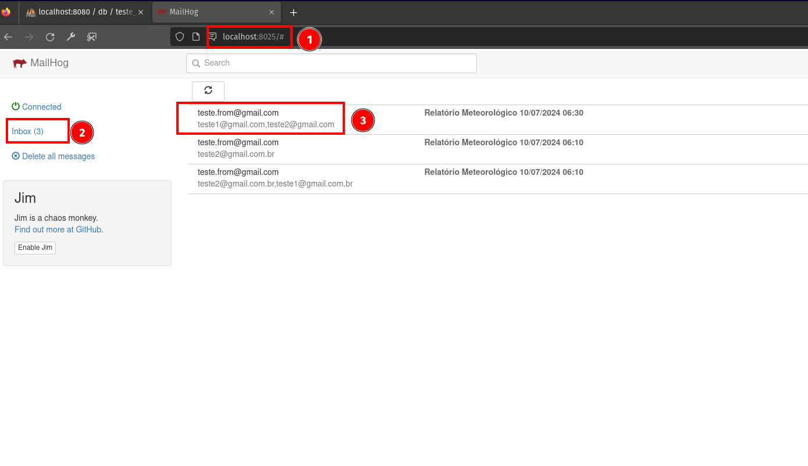
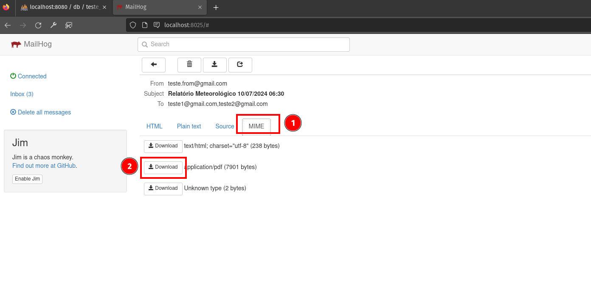

# Teste Técnico da NIMBUS

Vídeo usando a aplicação 1 e aplicação 2

## Sumário

- [Tecnologias e libs usadas](#tecnologias-e-ferramentas-usadas)
- [Como executar?](#como-executar)
  - [Executando a aplicação 1](#executando-a-aplicação-1)
  - [Executando a aplicação 2](#executando-a-aplicação-2)
  - [Como executar os testes?](#como-executar-os-testes)
  - [Gerar o relatório de cobertura de código?](#gerar-o-relatório-de-cobertura-de-código-aplicação-1)
- [Arquitetura usada e desenho](#arquitetura-usada-e-desenho)
- [Padrões usados](#padrões-usados)
- [Ferramentas de GUI](#ferramentas-de-gui)
  - [Client HTTP (REST Client)](#client-http-rest-client)
  - [GUI para banco de dados (phpMyAdmin)](#gui-para-banco-de-dados-phpmyadmin)
  - [GUI para email (Mailhog)](#gui-para-email-mailhog)
- [Checklist](#checklist)
- [Melhoria nos sistemas](#melhoria-nos-sistemas)

## Tecnologias e ferramentas usadas

- Python 3.12.5
- Django e Django REST framework
- PyTest, Faker, PyTest Mock, PyTest Django
- Docker 20.10.23
- Docker Compose 2.15.1
- Dev Container
- MySQL e phpMyAdmin
- Cerberus
- Loguru
- ReportLab

## Como executar?

- Resumo
  - Para iniciar os containers, execute `make init-all`.
  - `make app1-start` para executar (o comando acima já executa) a aplicação 1.
  - `make app2-start` para executar a aplicação 2.

### Executando a aplicação 1

- Execute o comando `make app2-start` para rodar as migrations e iniciar o servidor.
- Acesse o arquivo `./docs/customer.http` para testar a api. É preciso instalar o extensão do VS Code chamada Rest Client.
- Acesse `http://localhost:8080` para visualizar o banco de dados pelo phpMyAdmin.
- Os logs da aplicação 1 está na pasta `./aplicacao-1/logs/`.

### Executando a aplicação 2

- Configure o SMTP na pasta `./aplicacao-2/constants.py`.
  - Caso queira usar o mailhog para testar o envio de email, deixe a constante `SMTP_TEST = True`.
  - Caso queira usar outro servidor, marque como `False` e configure o `FROM_EMAIL`, `FROM_PASSWORD`, `SMTP_HOST`, e `SMTP_PORT`.
- Coloque o arquivo bruto dentro da pasta `./aplicacao-2/` para o docker conseguir acessar. O caminho para o script acessar o arquivo bruto será `/app/aplicacao-2/<nome-do-arquivo>`.
- Execute `make app2-start` para iniciar o script.
- Os logs da aplicação 1 está na pasta `./aplicacao-2/logs/`.
- Acesse `http://localhost:8025` para visualizar os emails enviados, caso esteja usando o mailhog
- Os relatórios são armazenados na pasta `./aplicacao-2/reports/`.

### Como executar os testes?

#### Aplicação 1

- `make app1`: acessa o container da aplicação 1.
- `make test`: executa os testes.

#### Aplicação 2

- `make app2`: acessa o container da aplicação 2.
- `make test`: executa os testes.

### Gerar o relatório de cobertura de código? (Aplicação 1)

- `make app1`: acessa o container.
- `make test-cov`: executa a geração do relatório de cobertura de código.

## Arquitetura usada e desenho

Por quê foi usada arquitetura em camadas?

- Facilita o mock para os testes de integração e de unidade.
- Separa as responsabilidades do código, facilitando a manutenção.

### Desenho da arquitetura

- Service: orquestra a lógica de negócio.
- Repository: meio para qualquer acesso a serviços externos como api, banco de dados e etc.

## Padrões usados

- Service
- Repository
- Fail Fast/Early Return
- Dependency Injection
- Single Responsability Principle (SRP)
- Evitei usar o List Comprehension no caso de if e for para deixar o código mais legível

## Ferramentas de GUI

### Client HTTP (REST Client)

Foi usado a extensão Rest Client do VSCode para os testar os endpoints (como insomnia ou postman).

### GUI para banco de dados (phpMyAdmin)

Foi usado o phpMyAdmin como interface gráfica para o banco de dados.

### GUI para email (Mailhog)

Foi usado o mailhog como SMTP server local para testar envio de email.

## Checklist

- Projeto todo

  - [ ] C4 Model para a documentação das aplicações
  - [x] Commits semânticos

- Aplicação 1

  - Obrigatório:
    - [x] Execução contínua, parando com comando explícito
    - [x] Recepção de dado via protocolo TCP/IP (Django)
    - [x] Armazenamento de dado (Banco com MySQL)
    - [x] Responde "Ok" para o cliente quando tudo der certo
    - [x] Os dados devem ser e estar no seguinte formato: nome,email,telefone,idade
    - [x] Caso não atenda ao formato (validação com Cerberus), deve lançar erro com resposta genérica
  - Opicional:
    - [x] Logs com loguru
    - [x] Testes automatizados com PyTest
    - [ ] Testar todas as possibilidades de input, erros e branches
    - [ ] API Versioning
    - [x] Tratamento de error
    - [x] Separação por layers

- Aplicação 2

  - Obrigatório:
    - [x] Script deve receber os parametros:
      - [x] Telefone: um ou mais separado por vírgula
      - [x] Data: Y/m/d H:m:s
      - [x] Envia_email: relatório deverá ou não ser enviado por email
      - [x] Bruto: caminho para o arquivo bruto
    - [x] Consultar dados informações salvas no banco de acordo com os parametros de entrada
    - [x] Deve ler as informações de mensagem e evento do arquivo bruto de forma dinâmica
    - [x] Gerar relatório (ReportLab)
      - [x] Previsão de fenomeno deve ser agrupado por data e mensagem
      - [x] Fenômeno deve ser marcado com vermelho se na mensagem aparecer a palavra "forte"
      - [x] Seções do pdf: 1 - análise, 2 - previsões
      - [x] Cada seção de previsão deve começar em nova página
      - [x] Cabeçalho: título, nome do cliente, data da confecção, tipo do conteúdo (Análise ou Previsão)
    - [x] Envio do relatório por email
      - [x] Título com data do relatório
      - [x] PDF anexado
      - [x] Email de origem deve ser configuravel por constante
    - [x] Registrar logs em um arquivo (Loguru)
  - Opicional:
    - [x] Testes automatizados com PyTest
    - [ ] Testar as barnches de process_raw_file
    - [ ] Buscar informações pela api (requests)
    - [x] Tratamento de error
    - [x] Separação por layers

## Melhoria nos sistemas

- Deixar o relatório mais parecido com o exemplo, como:
  - "Análise" ou "Previsão" fazer parte do Header e se repetir em cada página
  - Centralizar verticalmente o fenomeno no background e mover o background para a esquerda
- Testar mais possibilidades no código (aplicação 1 e aplicação 2) para assegurar que tudo funcione, como:
  - Possibilidade de input, limite máximo e mínimo
  - Branches
  - Casos de erro
- Permitir uso de segundos e mais dados na data de confecção na aplicação 2
- Melhorar a validação da aplicação 2
