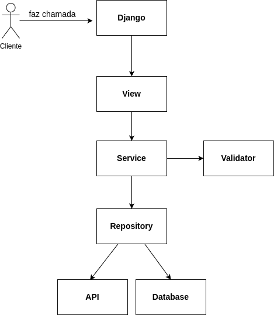
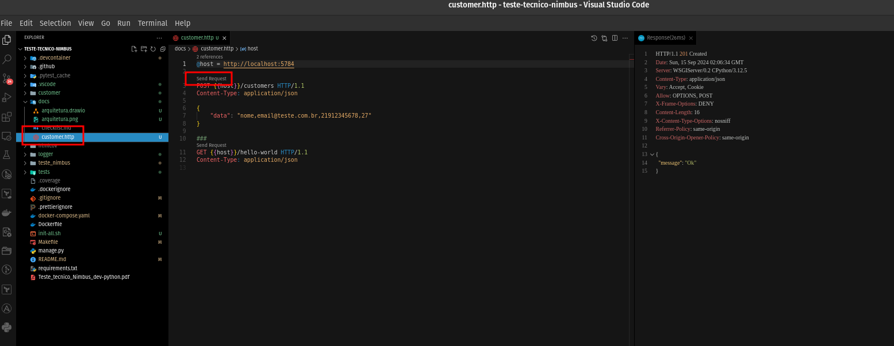
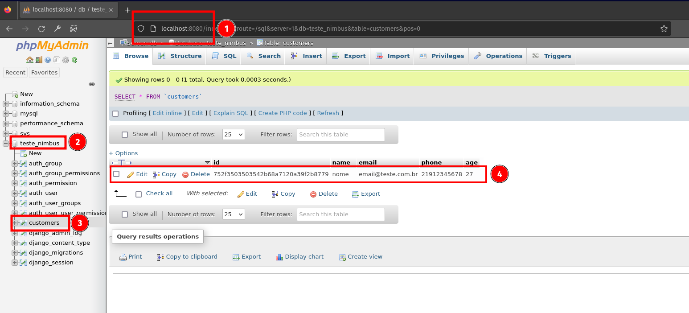

# Teste Técnico da NIMBUS

## Sumário

- [Tecnologias e libs usadas](#tecnologias-e-ferramentas-usadas)
- [Como executar?](#como-executar)
  - [Como executar?](#iniciar-tudo)
  - [Iniciar o servidor](#iniciar-o-servidor)
  - [Como executar os testes?](#como-executar-os-testes)
  - [Gerar o relatório de cobertura de código?](#gerar-o-relatório-de-cobertura-de-código)
- [Arquitetura usada e desenho](#arquitetura-usada-e-desenho)
- [Padrões usados](#padrões-usados)
- [Client HTTP](#client-http-testar-endpoints)
- [GUI para banco de dados](#gui-para-banco-de-dados)
- [Checklist](#checklist)
- [Melhoria no sistema](#melhoria-no-sistema)

## Tecnologias e ferramentas usadas

- Python 3.12.5
- Django e Django REST framework
- PyTest, Faker, PyTest Mock, PyTest Django
- Docker 20.10.23
- Docker Compose 2.15.1
- Dev Container
- MySQL e phpMyAdmin
- Cerberus
- Loguru
- ReportLab

## Como executar?

### Iniciar tudo

- `make init-all`: inicia os containers, executa as migrations, gera a cobertura de código e inicia o servidor.

**OU**

- `make up`: inicia os containers.
- `make start-server`: executa as migrations e inicia o servidor.

**OU**

- `docker compose up -d`: inicia os containers.
- `docker compose exec -it app bash`: acessa o container.
  - `python manage.py migrate`: executa as migrations.
  - `python manage.py runserver 0.0.0.0:5784`: inicia o servidor.

### Iniciar o servidor

- `make start-server`

### Como executar os testes?

- `make exec`: acessa o container.
- `make test`: executa os testes.

### Gerar o relatório de cobertura de código?

- `make exec-root`: acessa o container como root.
- `make test-cov`: executa a geração do relatório de cobertura de código.

## Arquitetura usada e desenho

Por quê foi usada arquitetura em camadas?

- Facilita o mock para os testes de integração e de unidade.
- Separa as responsabilidades do código, facilitando a manutenção.

### Desenho da arquitetura

- Service: orquestra a lógica de negócio.
- Repository: meio para qualquer acesso a serviços externos como api, banco de dados e etc.

## Padrões usados

- Service
- Repository
- Fail Fast/Early Return
- Dependency Injection
- Single Responsability Principle (SRP)

## Client HTTP (Testar endpoints)

Foi usado a extensão Rest Client do VSCode para os testar os endpoints (como insomnia ou postman).

## GUI para banco de dados

Foi usado o phpMyAdmin como interface gráfica para o banco de dados.

## Checklist

- Projeto todo

  - [ ] C4 Model para a documentação das aplicações
  - [x] Commits semânticos

- Aplicação 1

  - Obrigatório:
    - [x] Execução contínua, parando com comando explícito
    - [x] Recepção de dado via protocolo TCP/IP (Django)
    - [x] Armazenamento de dado (Banco com MySQL)
    - [x] Responde "Ok" para o cliente quando tudo der certo
    - [x] Os dados devem ser e estar no seguinte formato: nome,email,telefone,idade
    - [x] Caso não atenda ao formato (validação com Cerberus), deve lançar erro com resposta genérica
  - Opicional:
    - [x] Logs com loguru
    - [x] Testes automatizados com PyTest
    - [ ] Testar todas as possibilidades de input, erros e branches
    - [ ] API Versioning
    - [x] Tratamento de error
    - [x] Separação por layers

- Aplicação 2

  - Obrigatório:
    - [ ] Script deve receber os parametros:
      - [ ] Telefone: um ou mais separado por vírgula
      - [ ] Data: Y/m/d H:m:s
      - [ ] Envia_email: relatório deverá ou não ser enviado por email
      - [ ] Bruto: caminho para o arquivo bruto
    - [ ] Consultar dados informações salvas no banco de acordo com os parametros de entrada
    - [ ] Deve ler as informações de mensagem e evento do arquivo bruto de forma dinâmica
    - [ ] Gerar relatório (ReportLab)
      - [ ] Previsão de fenomeno deve ser agrupado por data e mensagem
      - [ ] Fenômeno deve ser marcado com vermelho se na mensagem aparecer a palavra "forte"
      - [ ] Seções do pdf: 1 - análise, 2 - previsões
      - [ ] Cada seção de previsão deve começar em nova página
      - [ ] Cabeçalho: título, nome do cliente, data da confecção, tipo do conteúdo (Análise ou Previsão)
    - [ ] Envio do relatório por email
      - [ ] Título com data do relatório
      - [ ] PDF anexado
      - [ ] Email de origem deve ser configuravel por constante
    - [ ] Registrar logs em um arquivo (Loguru)
  - Opicional:
    - [ ] Testes automatizados com PyTest
    - [ ] Testar todas as possibilidades de input, erros e branches
    - [ ] Buscar informações pela api (requests)
    - [ ] Tratamento de error
    - [ ] Separação por layers

## Melhoria no sistema
